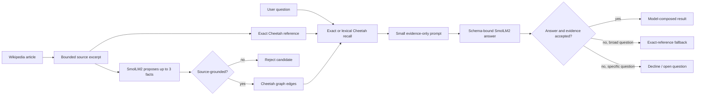

# Cheetah memory benchmarks and practical retrieval results

This document records what MiniPhi actually achieved with Cheetah as external real-time memory, how Wikipedia information was identified and saved, and how retrieved evidence was placed into the model context to produce a final answer. It uses the completed four-hour run from 2026-08-01 plus a ten-question same-question follow-up from 2026-08-02 rather than hypothetical examples.

## Reference setup and evidence

- MiniPhi commits: `ce9e1b1` (Wikipedia learning) and `c92f4d5` (timed soak runner)
- Cheetah commit: `0e37e24`
- Dataset: `E:\Models\datasets\wiki-data-2021`
- Cheetah database: `wikidata`
- LM Studio: `http://192.168.56.1:1234`
- Model: `smollm2-360m-instruct` (`SmolLM2-360M-Instruct-GGUF`, Q8_0)
- Loaded context: 8,192 tokens
- Session: `.miniphi/cheetah/soak/2026-08-01T16-24-39-159Z/`
- Duration: 4 hours and 0.906 seconds
- Workload: 39 cycles, 100 Wikipedia records per cycle, five retained subjects probed every 25 records

The raw evidence is retained in `session.json`, `events.jsonl`, 39 checkpoint snapshots, 39 complete benchmark snapshots, and the associated stdout/stderr logs. Benchmark snapshots retain the raw response text, usage, tool definitions, and validation result.

Implementation map:

- [local-wikipedia-dataset.js](../src/libs/local-wikipedia-dataset.js): streaming shard parser and byte-position resume;
- [cheetah-wikipedia-runner.js](../src/libs/cheetah-wikipedia-runner.js): bounded article loop, checkpoints, fixed-subject probes, counters, and regression detection;
- [cheetah-learner.js](../src/libs/cheetah-learner.js): schema-bound teach/recall prompts, source filter, evidence adjudication, and deterministic fallback;
- [cheetah-knowledge-client.js](../src/libs/cheetah-knowledge-client.js): stable ids, episodic writes, graph writes, and bounded recall ladder;
- [agent-session.js](../src/agent/agent-session.js): optional `knowledge_lookup` observation and layered context-budget integration;
- [cheetah-teach schema](prompts/cheetah-teach.schema.json) and [cheetah-recall schema](prompts/cheetah-recall.schema.json): exact JSON contracts sent through `response_format=json_schema`.

## Results at a glance

| Path being measured | Result | What it demonstrates |
| --- | ---: | --- |
| SmolLM2 model-only Easy benchmark | 234/234 schema-valid trials were incorrect; quality 35 in every category and cycle | The 360M base model followed the JSON shape but was weak at reasoning, coding, context, writing, research, and tool-use tasks without help from the knowledge store. |
| Cheetah retrieval | 780/780 subject queries resolved during the soak | Exact early memories remained findable after thousands of later writes. |
| Cheetah evidence + SmolLM2 composition | 35/780 answers passed the current structural grounding check | The model sometimes composed an answer from retrieved evidence, but this is an upper bound because the validator accepted some low-quality answers. |
| Cheetah exact-reference fallback | 745/780 answers | When SmolLM2 could not compose a trustworthy broad answer, MiniPhi returned the exact stored source reference. |
| Recorded effective-grounding metric | 780/780, with zero recorded retrieval/grounding regressions and zero probe errors | The memory layer supplied reference availability every time. This is a structural metric, not a human semantic-quality score for the 35 model-composed answers. |
| Follow-up, same-question closed-book control | 0/10 useful factual answers | On 2026-08-02 the model was asked the exact ten questions documented below without retrieved context. Nine `answer` fields were empty and one was an explicit decline. |
| Follow-up, same ten questions with `wikidata` | 10/10 anchors resolved; 5 exact-reference answers and 5 safe declines | Cheetah found evidence for every question. SmolLM2 composed 0 accepted answers in this pass; broad questions used the exact reference, while specific questions abstained under the current conservative policy. |

The four-hour Easy suite and 780 retention probes are related but are not a perfect same-question ablation: the Easy suite does not ask the five retention questions. Therefore, this report does **not** claim that the no-memory score for those 780 questions was 35/780 or 0/780. The later ten-question follow-up is a direct, same-question diagnostic; it is smaller than the soak and is reported separately below.

## Without memory versus with memory

### Without Cheetah knowledge memory

The 39 Easy benchmark snapshots made 234 independent model calls (six per cycle). Every response was valid against the required JSON schema, but every task answer was scored incorrect. Examples included:

| Trial | Model answer | Outcome |
| --- | --- | --- |
| Reasoning sequence | `2` | Incorrect |
| Coding execution | `.` | Incorrect |
| Context retrieval | Empty answer, although `amber-field-118` appeared in `evidence` | Incorrect |
| Research source choice | Empty answer | Incorrect |
| Tool planning | Empty answer | Incorrect |
| Writing constraints | `Calm tools build trust.` | Schema-valid but did not satisfy the complete trial constraints |

The model-only overall score was 41 in 12 snapshots and 40 in 27. Category quality remained 35; the overall difference came only from speed. Mean latency was 2,462.3 ms, rising from 2,140.2 ms for the first ten cycles to 2,730.3 ms for the last ten.

This control shows why MiniPhi does not treat a schema-valid response as a fact. JSON validity proves interface compliance, not factual correctness.

### With Cheetah memory available

During the same session, MiniPhi issued 156 retention probes over five subjects, or 780 questions. Cheetah resolved all 780 subject anchors and supplied stored evidence every time. SmolLM2 passed the current grounding check on 35 answers; MiniPhi used an exact-reference fallback on the other 745.

The recorded retrieval and grounding metrics were stable even though model generation was stochastic:

- first half: 15 model-composed answers and 375 reference fallbacks;
- second half: 20 model-composed answers and 370 reference fallbacks;
- final probe: 0/5 model-composed and 5/5 exact-reference fallback;
- retrieval or grounding regressions: 0;
- probe errors: 0.

The small first-half/second-half difference is not evidence that the model weights learned. SmolLM2 was never fine-tuned. Cheetah learned by persisting external memories, and each inference received retrieved evidence as fresh context.

## Practical results by remembered subject

Each subject was queried 156 times while 3,900 more Wikipedia records were attempted.

| Subject | Cheetah resolved | Model passed structural check | Exact-reference fallback | Errors |
| --- | ---: | ---: | ---: | ---: |
| M-137 (Michigan highway) | 156/156 | 16 | 140 | 0 |
| Dynamic density | 156/156 | 0 | 156 | 0 |
| Marc Fein | 156/156 | 5 | 151 | 0 |
| Alphyn | 156/156 | 5 | 151 | 0 |
| HaMoshava Stadium | 156/156 | 9 | 147 | 0 |

### Example 1: Dynamic density

SmolLM2 never produced a directly accepted answer in 156 attempts. Cheetah nevertheless found the same exact source reference 156/156 times, so the final broad answer remained grounded. The stored reference began:

> In sociology, dynamic density refers to the combination of two things: population density and the amount of social interaction within that population.

This is the clearest difference between model knowledge and external memory: the model could not reliably compose the fact, but the system could still retrieve and return the learned source.

### Example 2: HaMoshava Stadium

Cheetah resolved the subject 156/156 times. SmolLM2 produced nine structurally accepted responses, including a useful concise result:

> The HaMoshava Stadium is a football stadium in Petah Tikva, Israel.

It also produced low-value responses such as `Yes` and `The HaMoshava Stadium.`. On the other 147 probes, MiniPhi returned the authoritative stored excerpt, which also stated that the stadium was completed in 2011 and is home to Hapoel Petah Tikva and Maccabi Petah Tikva.

### Example 3: M-137 (Michigan highway)

Cheetah resolved this memory 156/156 times. SmolLM2 sometimes copied the useful learned description, but other structurally accepted outputs included `M-137`, `yes`, `{2}`, and `MiniPhi Cheetah recall turn`. The reference fallback returned the stable learned passage describing M-137 as a former Michigan state trunkline spur serving the Interlochen Center for the Arts and Interlochen State Park.

### Example 4: Marc Fein

Cheetah resolved the subject 156/156 times. Only five model responses passed the current structural check, and manual inspection found both useful statements and bad answers such as `Yes`, `[null]`, and `I'm not sure what you're asking.`. The exact-reference path consistently retained the source description of Fein as a sports journalist, anchor, and television studio host.

### Example 5: Alphyn

Cheetah resolved the subject 156/156 times. Five responses passed the structural model check; 151 used the exact reference. Useful direct output closely restated the reference describing an alphyn as a heraldic creature whose name derives from a Germanic word for "chaser" or "wolf."

### Important interpretation of `modelGrounded`

The current check requires:

1. a resolved Cheetah anchor;
2. `grounded: true` from the schema-valid model response;
3. a non-empty, non-decline answer; and
4. at least one model `evidence` item that matches a retrieved reference.

It does not yet prove that the answer itself is semantically entailed by that evidence. Manual inspection found cases where a poor answer was paired with matching evidence and was therefore counted among the 35. Treat 35/780 as an **upper bound on model composition**, not as 35 guaranteed high-quality answers. The exact-reference fallback is the stronger result because its returned text is itself the stored evidence.

## Ten complete, same-question prompt traces

This follow-up was run on 2026-08-02 with the same `smollm2-360m-instruct` endpoint and the already-trained `wikidata` database. It adds the requested ten concrete examples and a direct closed-book control for each exact question. These are actual outputs, including weak and contradictory model responses; they are not cleaned-up demonstrations.

| # | Question subject | Closed book | Cheetah anchor | Raw recall composition | MiniPhi final result |
| ---: | --- | --- | ---: | --- | --- |
| 1 | M-137 | Empty answer | yes | Decline/contradictory flags | Safe decline; one open-question hypothesis recorded |
| 2 | Dynamic density | Empty answer | yes | Decline/bogus evidence | Safe decline |
| 3 | Marc Fein | Empty answer | yes | Decline/unsupported evidence | Safe decline |
| 4 | Alphyn | Empty answer | yes | Decline despite matching evidence | Safe decline |
| 5 | HaMoshava Stadium | `I do not know` | yes | Decline/empty evidence | Safe decline |
| 6 | Carinya Christian School | Empty answer | yes | Ungrounded decline | Exact-reference fallback |
| 7 | Asian Young Footballer of the Year | Empty answer | yes | Decline despite relevant evidence | Exact-reference fallback |
| 8 | Pie crust crab | Empty answer | yes | Decline/unrelated evidence | Exact-reference fallback |
| 9 | Wiyot traditional narratives | Empty answer | yes | Useful-looking answer but no evidence | Exact-reference fallback |
| 10 | More Than I Know | Empty answer | yes | Decline | Exact-reference fallback |

The closed-book result was 0/10 useful factual answers. With memory, retrieval was 10/10, but the final user-visible result was useful on only the five broad questions because the current policy deliberately does not return a whole article reference as the answer to a specific question. The retrieved passages did contain the requested details in examples 1-5, so those five declines expose a real composition/adjudication improvement opportunity rather than a Cheetah retrieval failure.

### Exact prompt protocol used by all ten traces

There is no hidden conversational history. Each call is a fresh request. To avoid printing the same long instructions and schema twenty times, the invariant prompt fragments are shown once below and every example then shows the exact substituted payload. Concatenating the shared fragment with an example payload reconstructs that complete prompt. The archived exchange named in each example retains the fully rendered `messages`, `response_format`, raw response text, usage, tool calls, and validation outcome.

The exact closed-book prompt template was:

```text
You are running a closed-book MiniPhi factual benchmark without external memory or retrieved context.
Use only knowledge already present in the model weights. If unsure, use the exact decline phrase: I do not know.
Trial id: {TRIAL_ID}
Question: {QUESTION}
Return exactly one JSON object and no prose.
Exact JSON schema: {"$schema":"https://json-schema.org/draft/2020-12/schema","$id":"model-benchmark-trial@v1","type":"object","additionalProperties":false,"required":["schema_version","trial_id","answer","evidence","needs_more_context","missing_snippets"],"properties":{"schema_version":{"const":"model-benchmark-trial@v1"},"trial_id":{"type":"string","minLength":1},"answer":{"type":"string"},"evidence":{"type":"array","maxItems":3,"items":{"type":"string"}},"needs_more_context":{"type":"boolean"},"missing_snippets":{"type":"array","items":{"type":"string"}},"stop_reason":{"type":"string"}}}
Set schema_version to model-benchmark-trial@v1 and trial_id to {TRIAL_ID}.
Set evidence to [], needs_more_context to false, missing_snippets to [], and stop_reason to completed.
```

It also sent that schema through `response_format={"type":"json_schema",...}`. All ten closed-book outputs were schema-valid on the first attempt, even though several violated the natural-language request to leave `evidence` empty. This is another example of JSON validity not implying task correctness.

Every teach and recall call used this exact system prompt:

```text
You serve an external database that starts out empty, no matter how famous or obvious a subject is. You never answer factual questions from your own training knowledge, and you never skip saving a fact just because it feels obvious to you - only what the database already has counts as 'known'. You only work from what is explicitly given to you in each prompt: a text snippet to learn from plus what the database already records, or facts retrieved from the database to answer a question from. Always reply with strict JSON matching the requested schema only - no commentary, no markdown fences.
```

The exact teach user prompt template was:

```text
Extract facts from exactly one source snippet for an external database.
The database starts empty. 'Already known' means recorded in the database list below, never facts from your training.
Do not copy or invent facts from instructions, examples, or prior knowledge.
SOURCE TEXT: {SOURCE_TEXT}
Canonical source title: "{SUBJECT}". Use this exact value for subject_name; do not rename or shorten it.
Already recorded in the database about this subject: nothing is recorded yet about this subject.
Rules:
- Extract AT MOST 3 new facts as (relation, object) pairs about the subject.
- Every object_name MUST be copied verbatim as a contiguous phrase from SOURCE TEXT. If it does not occur in SOURCE TEXT, do not output it.
- Build relation only from a verb written near that object in SOURCE TEXT. Do not infer a relation from prior knowledge.
- Only set no_new_information=true if every fact in the snippet is already in the 'Already recorded' list above.
- If the snippet hedges ('may', 'is thought to', 'probably'), set confidence to possible/probable rather than omitting it.
- In `thinking`, explicitly say what you are choosing to save because the database does not have it yet.
- Set stop_reason to "completed".
Return strict JSON only that matches this schema:
{MINIFIED_CONTENTS_OF_docs/prompts/cheetah-teach.schema.json}
```

The exact recall user prompt template was:

```text
Read the facts below, then answer the question using ONLY those facts - never your own training knowledge.
Facts about the subject:
- "{RETRIEVED_REFERENCE}"
Question: {QUESTION}
Decide: do the facts above, read plainly, answer this exact question? If yes, set grounded=true, write a non-empty answer using their wording, and copy at least one used fact into evidence.
If the facts above are empty, unrelated, or do not mention what the question asks, set grounded=false, answer that you don't know, and fill in open_question.
Set stop_reason to "completed".
Return strict JSON only that matches this schema:
{MINIFIED_CONTENTS_OF_docs/prompts/cheetah-recall.schema.json}
```

The braces on the two schema lines are documentation substitutions only. In every real request MiniPhi embedded the complete minified [teach schema](prompts/cheetah-teach.schema.json) or [recall schema](prompts/cheetah-recall.schema.json) at that position and sent the same object through `response_format=json_schema`. The per-example archive paths below are the byte-for-byte record when exact whitespace matters.

### Trace 1: M-137

Prompt substitutions and archives:

```text
TRIAL_ID: wiki-memory-m137
QUESTION: What was M-137 and what places did it serve?
SUBJECT: M-137 (Michigan highway)
SOURCE_TEXT / RETRIEVED_REFERENCE: M-137 was a state trunkline highway in the US state of Michigan that served as a spur route to the Interlochen Center for the Arts and Interlochen State Park. It started south of the park and ran north between two lakes in the area and through the community of Interlochen to US Highway 31 (US 31) in Grand Traverse County.
```

- Closed-book exchange: `.miniphi/prompt-exchanges/c65b56bb-4a90-40ca-9d2c-59e01fff28b6.json`; raw result: `{"answer":"","evidence":["I do not know"]}`.
- Teach exchange: `.miniphi/prompt-exchanges/700bc2eb-e223-4625-890c-6f6d6cbe3e0b.json`; SmolLM2 returned the canonical name, the wrong type `person`, `no_new_information:true`, and no facts. MiniPhi still retained the canonical exact source reference and wrote no optional semantic edge.
- Recall exchange: `.miniphi/prompt-exchanges/de0ab44d-7208-400e-9135-5f27e3423762.json`; SmolLM2 returned `anchor_resolved:false`, `grounded:true`, `answer:"I don't know"`, and empty evidence. MiniPhi rejected the contradictory answer even though its own Cheetah lookup had resolved the anchor.
- Final result: `I don't know.` Because this CLI call used the normal `recordMiss:true` behavior, MiniPhi also saved `hypothesis:what_was_m_137_and_what_places_did_it_serve` as an open question. The other nine diagnostic calls disabled miss recording so the benchmark would not add more hypotheses.

### Trace 2: Dynamic density

```text
TRIAL_ID: wiki-memory-dynamic-density
QUESTION: What two components make up dynamic density?
SUBJECT: Dynamic density
SOURCE_TEXT / RETRIEVED_REFERENCE: In sociology, dynamic density refers to the combination of two things: population density and the amount of social interaction within that population. Émile Durkheim used the term to explain why societies transition from simple to more complex forms, specifically in terms of the division of labor within that society. He suggested that it required both an increase in population and an increase in the frequency of social interaction to form more specialised occupations, which then leads to a new type of society.
```

- Closed-book exchange: `.miniphi/prompt-exchanges/30182e34-1da7-4737-b9a8-0996fffa7ab0.json`; raw answer was empty.
- Teach exchange: `.miniphi/prompt-exchanges/25f12512-1f66-42bf-9162-13b638991ed9.json`; SmolLM2 renamed the subject to `MiniPhi Cheetah teach turn`, labelled it `person`, and emitted no new facts. MiniPhi overrode the name with the authoritative title and saved the exact reference, not the hallucinated metadata.
- Recall exchange: `.miniphi/prompt-exchanges/da7cf9ff-aa9b-45ff-b092-4a8dc613524e.json`; raw fields were `{"anchor_resolved":false,"grounded":true,"answer":"I don't know","evidence":["The Facts","The Schema"]}`. MiniPhi rejected both the decline and the non-reference evidence.
- Final result: `I don't know.` The reference clearly contains the correct answer—population density plus social interaction—but the specific-question policy did not substitute the whole reference.

### Trace 3: Marc Fein

```text
TRIAL_ID: wiki-memory-marc-fein
QUESTION: What kinds of work did Marc Fein do?
SUBJECT: Marc Fein
SOURCE_TEXT / RETRIEVED_REFERENCE: Marc Fein (born Marc Alan Fein October 21, 1967 in Miami, Florida) is a sports journalist, sports news anchor, and television sports studio host, formerly one of the main studio hosts for the NBA TV show, NBA Gametime Live. He is also the host of its show, The Beat, and has been the substitute host for Ernie Johnson on the NBA on TNT.Quigley, Eileen S. (2006) International Television & Video Almanac ==Broadcasting career== Prior to his present work at NBA TV, Fein was at one time the exclusive studio host for and NASCAR on TNT Live!.
```

- Closed-book exchange: `.miniphi/prompt-exchanges/31454a89-7d7c-4a3f-b6e9-460650456ee5.json`; raw answer was empty.
- Teach exchange: `.miniphi/prompt-exchanges/68264dfe-eac2-4c0d-8c8d-b35e0ae8e3be.json`; the JSON matched the schema but contained malformed semantic values such as `subject_name:"[Marc Fein]"` and no new facts. MiniPhi used `Marc Fein` from the dataset and saved the exact reference.
- Recall exchange: `.miniphi/prompt-exchanges/29ff49d0-7695-40f1-ae01-533e9f3a73e7.json`; SmolLM2 answered `I don't know` while inventing four evidence descriptions instead of copying the reference. Validation rejected it.
- Final result: `I don't know.` The retrieved text says sports journalist, sports news anchor, and television sports studio host, but MiniPhi conservatively abstained rather than treating an unvalidated model paraphrase as the answer.

### Trace 4: Alphyn

```text
TRIAL_ID: wiki-memory-alphyn
QUESTION: What does the name Alphyn mean?
SUBJECT: Alphyn
SOURCE_TEXT / RETRIEVED_REFERENCE: A heraldic alphyn An Alphyn (from the Germanic word for "chaser" or "wolf"), also known as awfyn or alfin in older writings,The Chess player's chronicle. Oxford Press, 1841.
```

- Closed-book exchange: `.miniphi/prompt-exchanges/615da8c4-6173-4484-9234-af9ddb6a7123.json`; raw answer was empty and its spurious evidence was `Wiki memory`.
- Teach exchange: `.miniphi/prompt-exchanges/7040452a-d382-44ca-8bfc-8a7c7688a0b7.json`; the model selected the canonical name but the wrong type `person` and no graph facts. The exact reference was still saved.
- Recall exchange: `.miniphi/prompt-exchanges/11991913-47dc-4165-899e-6d7f0ba35e19.json`; the model copied the correct reference into `evidence` but still set `answer:"I don't know"`. MiniPhi rejected a decline as a grounded answer.
- Final result: `I don't know.` The stored evidence says the name comes from a Germanic word for “chaser” or “wolf”; current specific-question handling did not extract that answer deterministically.

### Trace 5: HaMoshava Stadium

```text
TRIAL_ID: wiki-memory-hamoshava
QUESTION: Where is HaMoshava Stadium and when was it completed?
SUBJECT: HaMoshava Stadium
SOURCE_TEXT / RETRIEVED_REFERENCE: The western stand, June 2016 Aerial view The HaMoshava Stadium (), also known as Petah Tikva Stadium, is a football stadium in Petah Tikva, Israel. It was completed in 2011, and is used mainly for football matches and is home to both Hapoel Petah Tikva and Maccabi Petah Tikva.
```

- Closed-book exchange: `.miniphi/prompt-exchanges/dd2960f1-a52a-4bcb-9f6a-747eafc2dc07.json`; raw answer: `I do not know`.
- Teach exchange: `.miniphi/prompt-exchanges/fe7b6102-1883-42e6-ae77-35eed15ed873.json`; SmolLM2 labelled the stadium `person` and emitted no facts. MiniPhi saved the canonical topic and exact reference.
- Recall exchange: `.miniphi/prompt-exchanges/a614dabb-fbbe-424a-91bc-924bafec22a0.json`; raw fields were `{"anchor_resolved":false,"grounded":true,"answer":"I don't know","evidence":["",""]}`. The answer failed validation.
- Final result: `I don't know.` Cheetah supplied both requested details—Petah Tikva, Israel and 2011—but the light model failed to compose them.

### Trace 6: Carinya Christian School

```text
TRIAL_ID: wiki-memory-carinya
QUESTION: What do you know about Carinya Christian School?
SUBJECT: Carinya Christian School
SOURCE_TEXT / RETRIEVED_REFERENCE: Carinya Christian School is a multi-campus independent Christian comprehensive co-educational early learning, primary, secondary day school located in the New England region of New South Wales, Australia. The school caters for approximately 600 students from early learning to Year 12.
```

- Closed-book exchange: `.miniphi/prompt-exchanges/fe964db2-52b8-4c66-838e-0bfaefdccc64.json`; raw answer was empty.
- Teach exchange: `.miniphi/prompt-exchanges/33bf25b4-0b46-433b-968c-e05ae7964a0f.json`; the model emitted no new facts and merely put `located_in` in the non-persisted transparency field. MiniPhi saved the canonical exact source record.
- Recall exchange: `.miniphi/prompt-exchanges/62271907-fffb-4741-a314-2b3d4e5a2e53.json`; SmolLM2 explicitly said it used training knowledge, set `grounded:false`, and answered `I don't know`, despite copying much of the reference into `evidence`. MiniPhi rejected model composition.
- Final result (`answerSource=deterministic-reference-fallback`): `Carinya Christian School is a multi-campus independent Christian comprehensive co-educational early learning, primary, secondary day school located in the New England region of New South Wales, Australia. The school caters for approximately 600 students from early learning to Year 12.`

### Trace 7: Asian Young Footballer of the Year

```text
TRIAL_ID: wiki-memory-asian-footballer
QUESTION: What do you know about Asian Young Footballer of the Year?
SUBJECT: Asian Young Footballer of the Year
SOURCE_TEXT / RETRIEVED_REFERENCE: The Asian Young Footballer of the Year award is presented to the best young football player in Asia. It has been awarded by the Asian Football Confederation (AFC) since 1995.
```

- Closed-book exchange: `.miniphi/prompt-exchanges/9bff4de2-f826-4a7a-a321-4a26c0f6b024.json`; raw answer was empty.
- Teach exchange: `.miniphi/prompt-exchanges/a2b2afa8-fc3f-4c16-be5d-f0d9eb70f6a9.json`; SmolLM2 emitted no graph facts. Its `known_facts` strings are transparency-only and were not written as facts; MiniPhi saved the exact source reference.
- Recall exchange: `.miniphi/prompt-exchanges/58696660-4c98-4b80-8ed9-63219b1e4d6c.json`; the model copied two relevant evidence lines but answered `I don't know`, so composition was rejected.
- Final result (`answerSource=deterministic-reference-fallback`): `The Asian Young Footballer of the Year award is presented to the best young football player in Asia. It has been awarded by the Asian Football Confederation (AFC) since 1995.`

### Trace 8: Pie crust crab

```text
TRIAL_ID: wiki-memory-pie-crust-crab
QUESTION: What do you know about Pie crust crab?
SUBJECT: Pie crust crab
SOURCE_TEXT / RETRIEVED_REFERENCE: The pie crust crab (Metacarcinus novaezelandiae, formerly Cancer novaezelandiae), is a species of crab found around New Zealand and south- eastern Australia. == Diet and foraging == In larval form Metacarcinus novaezelandieae consumes mostly tiny plankton. Once fully grown though they are primarily carnivorous, hunting nocturnally and preying on a variety of organisms.
```

- Closed-book exchange: `.miniphi/prompt-exchanges/01803c4e-138e-4f8c-bb51-4e07df0fdfda.json`; raw answer was empty.
- Teach exchange: `.miniphi/prompt-exchanges/42bab444-0789-4b69-8a57-e16eb279f7f1.json`; the model labelled the crab `person`, proposed no facts, and invented a sentence in `known_facts`. MiniPhi ignored that field and saved the canonical source reference.
- Recall exchange: `.miniphi/prompt-exchanges/bc38cf94-d266-47e4-b562-8f18b94f9f26.json`; the model answered `I don't know.` and its two evidence strings described the prompt instead of the crab. MiniPhi rejected it.
- Final result (`answerSource=deterministic-reference-fallback`): the exact retrieved reference shown above, including the distribution, larval diet, and adult carnivorous behavior.

### Trace 9: Wiyot traditional narratives

```text
TRIAL_ID: wiki-memory-wiyot
QUESTION: What do you know about Wiyot traditional narratives?
SUBJECT: Wiyot traditional narratives
SOURCE_TEXT / RETRIEVED_REFERENCE: Wiyot traditional narratives include myths, legends, tales, and oral histories preserved by the Wiyot people of the Humboldt Bay area of northwestern California. Wiyot oral literature shares elements with the distinctive Yurok- Karuk-Hupa area of northwestern California, as well as with the more widely distributed patterns of central California. (See also Traditional narratives (Native California).) ==On-Line Examples of Wiyot Narratives== * The North American Indian by Edward S.
```

- Closed-book exchange: `.miniphi/prompt-exchanges/1e02f11e-5b34-45b8-b61d-6022f9d1f0ff.json`; raw answer was empty.
- Teach exchange: `.miniphi/prompt-exchanges/151b3c6f-1e48-44f0-a6af-eae3cc128b1f.json`; the model proposed no graph facts and mixed source paraphrases with hallucinated text in `known_facts`. MiniPhi did not persist that field; it saved the exact reference.
- Recall exchange: `.miniphi/prompt-exchanges/03c89c47-6d95-4ed4-85b0-c6e4e9604547.json`; SmolLM2 produced a useful-looking first-sentence answer, but also set `anchor_resolved:false`, supplied no evidence, and left `stop_reason` empty. MiniPhi correctly refused to trust the answer based on wording alone.
- Final result (`answerSource=deterministic-reference-fallback`): the exact retrieved reference shown above.

### Trace 10: More Than I Know

```text
TRIAL_ID: wiki-memory-more-than-i-know
QUESTION: What do you know about More Than I Know?
SUBJECT: More Than I Know
SOURCE_TEXT / RETRIEVED_REFERENCE: "More Than I Know" is the second single released under the Leftfield name. Paul Daley was not involved in the song's creation; however, the B-side was a remix of "Not Forgotten" by Daley requested by Neil Barnes.
```

- Closed-book exchange: `.miniphi/prompt-exchanges/56069b89-60fa-4a75-82f2-02f685fc8339.json`; raw answer was empty.
- Teach exchange: `.miniphi/prompt-exchanges/ca91472b-20ef-4aee-9b49-08af1127d31e.json`; SmolLM2 proposed `has_occupation -> [1]` and `born_in -> [4]`. Neither object occurs in the source, so MiniPhi rejected both candidates and saved only the exact source reference.
- Recall exchange: `.miniphi/prompt-exchanges/2e6a206f-f174-489a-9a5e-1d04282a1c2d.json`; the model copied relevant evidence but answered `I don't know`. MiniPhi rejected model composition.
- Final result (`answerSource=deterministic-reference-fallback`): `"More Than I Know" is the second single released under the Leftfield name. Paul Daley was not involved in the song's creation; however, the B-side was a remix of "Not Forgotten" by Daley requested by Neil Barnes.`

### What the ten traces demonstrate

- The 360M model can satisfy a JSON schema while leaving the answer empty, contradicting its own flags, misusing evidence, or copying prompt labels into semantic fields.
- MiniPhi, not SmolLM2, supplies the durable identity. The dataset title becomes the canonical topic id even when the model renames or mis-types the subject.
- Exact source references are the reliable learning unit. In these ten selected teach calls the model contributed no accepted semantic edge; one call proposed two candidates and both were rejected.
- Retrieval is distinct from answer composition: Cheetah resolved 10/10, while SmolLM2 produced 0/10 accepted recall answers in this pass.
- The broad-question fallback made five useful final answers possible without trusting faulty model output.
- The five specific-question declines show the next needed improvement: a deterministic extractive answer or entailment check that can return the relevant sentence span without broadening the answer beyond the requested detail.

## How MiniPhi identified information to learn

For each streamed Wikipedia row, MiniPhi performed the following bounded process:

1. The streaming reader selected a real `.json` shard, skipped `._*.json` sidecars, and parsed the top-level array without loading a multi-gigabyte shard into memory.
2. The Wikipedia `title` became the authoritative subject name. This prevents a weak model from renaming the article to prompt text such as `MiniPhi Cheetah teach turn`.
3. The article text was clipped to at most two leading sentences and 700 characters by default.
4. MiniPhi derived a stable type-independent topic id, for example `M-137 (Michigan highway)` -> `topic:m_137_michigan_highway`.
5. Before prompting, MiniPhi queried Cheetah for an outgoing-relation histogram. The teach prompt explicitly stated what the database already contained, rather than allowing the model to confuse pretraining knowledge with stored knowledge.
6. SmolLM2 received the exact source excerpt, canonical title, known relation types, and the complete `cheetah-teach` JSON schema. It could propose at most three `(relation, object_name)` facts.
7. MiniPhi independently filtered every proposed fact. `object_name` had to occur contiguously in the source, and meaningful relation terms had to be supported in the nearby source sentence.

During the final cumulative run, MiniPhi saved 3,933 exact source memories and 105 semantic facts while rejecting 2,275 unsupported fact candidates. This ratio is expected: exact source memory is authoritative, while tiny-model graph edges are optional indexing aids.

## How information was saved in Cheetah

MiniPhi saves each learned article in two complementary forms.

### 1. Episodic source record

The bounded source text is sanitized to one protocol-safe line and written through the official binder-backed `putValue` operation under an `episode:<timestamp>/<sequence>` pair key. MiniPhi retains the numeric Cheetah insert key returned by the server; it does not guess the key locally.

This source record allows a later process or a stronger model to re-extract knowledge from the original learned excerpt.

### 2. Graph memory

The subject is upserted as a `topic:<slug>` node with:

- the model-selected type as a label;
- `props.name` containing the canonical Wikipedia title; and
- an exact `references[]` entry containing the bounded source text and provenance.

Accepted objects become type-labelled entity nodes. Accepted facts become directed edges from the subject to the object. Each edge records `props.src` with the episodic insert key, `props.source` with Wikipedia shard/article provenance, and optional confidence.

The guaranteed subject/reference shape and the optional accepted-edge shape are:

```text
topic:hamoshava_stadium
  props.name = "HaMoshava Stadium"
  references[0].text = <bounded exact Wikipedia excerpt>

topic:<subject>
  -[:<accepted_relation> {src, source}]-> <type>:<object>
```

The exact reference is written even when SmolLM2 proposes no acceptable semantic edge. This is why 3,933 memories could remain useful despite only 105 accepted graph facts.

### 3. Resumable state

After every article, MiniPhi atomically updates `.miniphi/cheetah/wikipedia/wikidata-checkpoint.json` with the shard name, next byte offset, article ordinal, counters, retained subjects, recent results, probe history, and stop-reason fields. A restart resumes at the next record instead of relearning the whole shard.

## How retrieval supplied the needed information

MiniPhi uses a bounded recall ladder:

1. Strip a broad question prefix such as `What do you know about` to recover the likely subject.
2. Re-derive the stable `topic:<slug>` id and call exact `GRAPH_NODE_GET`.
3. If the node exists, fetch its outgoing relation histogram.
4. If relations exist, run a one-hop outward `GRAPH_RECALL` with a limit of eight associations, exact expansion, references enabled, and at most four references per association.
5. If the exact node does not exist, try a bounded lexical/synonym recall using up to four meaningful subject terms and a limit of five associations.
6. Compose a compact evidence block from at most six returned facts. Exact natural-language references are placed before synthesized triple sentences because the 360M model handles complete sentences more reliably.
7. Send only the evidence block, exact question, instructions, and complete `cheetah-recall` schema to SmolLM2.
8. Validate the JSON and independently compare the model's evidence strings with retrieved references.

The model never sends graph commands and never talks directly to Cheetah. MiniPhi controls retrieval, creates the prompt context, and adjudicates the output.

## How contexts are handled for the final result



There are three different context boundaries:

### Learning context

The teach call does not receive the whole article, dump, or conversation history. It receives a bounded source excerpt, authoritative title, a compact list of known relation types, instructions, and the exact JSON schema. This makes each article an independent, auditable learning unit.

### Recall context

The recall call receives only the retrieved reference/fact block, the current question, and the schema. At most six fact records are rendered, and graph recall hydrates at most four references per association. Old prompt transcripts are not appended. The source of truth is the current Cheetah retrieval.

For a broad question (`What do you know about <subject>?` or `Tell me about <subject>?`):

- if the model answer and evidence pass validation, MiniPhi returns the model answer;
- otherwise, if the exact subject and a stored reference were found, MiniPhi returns that reference deterministically;
- if nothing relevant was retrieved, MiniPhi returns `I don't know.`.

For a specific detail question, MiniPhi does not use the broad exact-reference fallback merely because the article is related. If retrieved evidence does not answer the detail, it declines and may record an open question.

### Interactive agent context

When `knowledgeLookup.enabled` (or `MINIPHI_KNOWLEDGE_LOOKUP=1`) points at `wikidata`, the normal MiniPhi agent may emit the read-only action:

```json
{
  "type": "knowledge_lookup",
  "subject": "HaMoshava Stadium"
}
```

The action returns structured Cheetah recall JSON without making a second LLM call. MiniPhi bounds the observation to 6,000 characters and stores it as a context-graph `evidence` node with kind `knowledge` and importance `0.75`. On the next agent turn, the layered `ContextGraph` selects full evidence, a digest, or a requestable stub according to the loaded model's token budget and current focus.

This `wikidata` knowledge memory is separate from `CheetahContextEngine`, which optionally mirrors the agent's own mission/plan/subtask context. Knowledge lookup supplies real-world evidence; the context engine prioritizes conversation/work evidence. Neither is allowed to bypass the final prompt budget.

## Final result decision rules

| Condition | Final result |
| --- | --- |
| Exact/lexical subject unresolved | Decline; optionally record an open question |
| Subject resolved, but a specific requested detail is unsupported | Decline rather than return a related paragraph |
| Broad subject question, model output invalid or ungrounded, exact reference available | Return the exact reference with `answerSource=deterministic-reference-fallback` |
| Model answer non-empty and its evidence matches a retrieved reference | Return model answer with `answerSource=model` (currently only structural assurance; see limitation above) |
| LM response is invalid JSON or times out | Retry once under the registered schema, then use deterministic schema-valid fallback behavior |

## Reliability and scale observations

- Exact memories added during the four-hour soak: 3,899 (3,933 cumulative).
- Grounded semantic edges added during the soak: 103 (105 cumulative).
- Unsupported semantic candidates rejected during the soak: 2,259 (2,275 cumulative).
- One malformed/empty dataset row was safely skipped.
- Retrieval stayed 5/5 at every soak probe as the database grew.
- All 39 full-suite invocations were green: 38 scheduled cycle gates plus one closing suite, with 319 passed, 0 failed, and 11 skipped per invocation.
- Benchmark latency increased by 27.6% from the first-ten to last-ten mean. Remote LM Studio exposed no resource telemetry, so the cause cannot be assigned to CPU, GPU, RAM, VRAM, or server load from this evidence.

## Recommended next strict memory A/B benchmark

The ten-trace follow-up adds a direct same-question closed-book comparison, while the four-hour run proves long-duration retention. The next reusable benchmark should automate and strengthen that diagnostic:

1. Select taught subjects and never-taught controls before training.
2. Ask each exact question with no Cheetah evidence through a registered closed-book schema.
3. Ask the same question with Cheetah retrieval context and preserve both model composition and final fallback.
4. Score four fields separately: anchor resolution, answer entailment, evidence match, and abstention correctness.
5. Add a semantic entailment or deterministic answer-to-reference overlap check so a matching `evidence` field cannot validate an unrelated answer.
6. Preserve raw prompts/responses and report model composition separately from exact-reference fallback.

The strongest supported conclusion from the soak plus this ten-question follow-up is:

> Cheetah gave MiniPhi stable access to learned Wikipedia source text across thousands of later writes. On ten exact follow-up questions SmolLM2 answered 0/10 usefully without memory, while Cheetah resolved 10/10 anchors; exact-reference retrieval, rather than model composition, was the dependable mechanism.

## Reproducing the benchmark

Run the reference workflow:

```powershell
node scripts/run-cheetah-wikipedia-soak.js --duration-hours 4
```

Resume the same deadline-bound session after repairing a failed gate:

```powershell
node scripts/run-cheetah-wikipedia-soak.js `
  --session-dir .miniphi\cheetah\soak\<session-id>
```

Inspect:

- `.miniphi/cheetah/wikipedia/wikidata-checkpoint.json` for counters and probe history;
- `.miniphi/cheetah/soak/<session-id>/snapshots/` for per-cycle checkpoints and benchmarks;
- `.miniphi/prompt-exchanges/` for complete schema-bound LM exchanges;
- `thirds/cheetah/cheetah_data/wikidata` for the Cheetah database;
- [`docs/cheetah-wikipedia-learning.md`](cheetah-wikipedia-learning.md) for setup, controls, and safety details.
