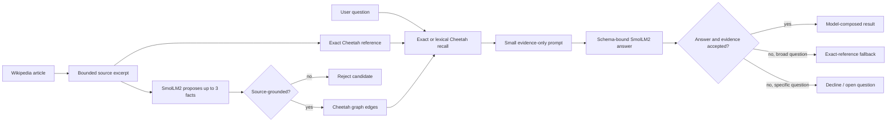

# Cheetah memory benchmarks and practical retrieval results

This document records what MiniPhi actually achieved with Cheetah as external real-time memory, how Wikipedia information was identified and saved, and how retrieved evidence was placed into the model context to produce a final answer. It uses the completed four-hour run from 2026-08-01 rather than hypothetical examples.

## Reference setup and evidence

- MiniPhi commits: `ce9e1b1` (Wikipedia learning) and `c92f4d5` (timed soak runner)
- Cheetah commit: `0e37e24`
- Dataset: `E:\Models\datasets\wiki-data-2021`
- Cheetah database: `wikidata`
- LM Studio: `http://192.168.56.1:1234`
- Model: `smollm2-360m-instruct` (`SmolLM2-360M-Instruct-GGUF`, Q8_0)
- Loaded context: 8,192 tokens
- Session: `.miniphi/cheetah/soak/2026-08-01T16-24-39-159Z/`
- Duration: 4 hours and 0.906 seconds
- Workload: 39 cycles, 100 Wikipedia records per cycle, five retained subjects probed every 25 records

The raw evidence is retained in `session.json`, `events.jsonl`, 39 checkpoint snapshots, 39 complete benchmark snapshots, and the associated stdout/stderr logs. Benchmark snapshots retain the raw response text, usage, tool definitions, and validation result.

Implementation map:

- [local-wikipedia-dataset.js](../src/libs/local-wikipedia-dataset.js): streaming shard parser and byte-position resume;
- [cheetah-wikipedia-runner.js](../src/libs/cheetah-wikipedia-runner.js): bounded article loop, checkpoints, fixed-subject probes, counters, and regression detection;
- [cheetah-learner.js](../src/libs/cheetah-learner.js): schema-bound teach/recall prompts, source filter, evidence adjudication, and deterministic fallback;
- [cheetah-knowledge-client.js](../src/libs/cheetah-knowledge-client.js): stable ids, episodic writes, graph writes, and bounded recall ladder;
- [agent-session.js](../src/agent/agent-session.js): optional `knowledge_lookup` observation and layered context-budget integration;
- [cheetah-teach schema](prompts/cheetah-teach.schema.json) and [cheetah-recall schema](prompts/cheetah-recall.schema.json): exact JSON contracts sent through `response_format=json_schema`.

## Results at a glance

| Path being measured | Result | What it demonstrates |
| --- | ---: | --- |
| SmolLM2 model-only Easy benchmark | 234/234 schema-valid trials were incorrect; quality 35 in every category and cycle | The 360M base model followed the JSON shape but was weak at reasoning, coding, context, writing, research, and tool-use tasks without help from the knowledge store. |
| Cheetah retrieval | 780/780 subject queries resolved during the soak | Exact early memories remained findable after thousands of later writes. |
| Cheetah evidence + SmolLM2 composition | 35/780 answers passed the current structural grounding check | The model sometimes composed an answer from retrieved evidence, but this is an upper bound because the validator accepted some low-quality answers. |
| Cheetah exact-reference fallback | 745/780 answers | When SmolLM2 could not compose a trustworthy broad answer, MiniPhi returned the exact stored source reference. |
| Recorded effective-grounding metric | 780/780, with zero recorded retrieval/grounding regressions and zero probe errors | The memory layer supplied reference availability every time. This is a structural metric, not a human semantic-quality score for the 35 model-composed answers. |

These rows are related but are not a perfect same-question ablation. The Easy suite is a general model-only control and does not ask the five Wikipedia retention questions. The retention probe always uses Cheetah. Therefore, this report does **not** claim that the no-memory score for those exact 780 questions was 35/780 or 0/780. A future strict A/B method is described below.

## Without memory versus with memory

### Without Cheetah knowledge memory

The 39 Easy benchmark snapshots made 234 independent model calls (six per cycle). Every response was valid against the required JSON schema, but every task answer was scored incorrect. Examples included:

| Trial | Model answer | Outcome |
| --- | --- | --- |
| Reasoning sequence | `2` | Incorrect |
| Coding execution | `.` | Incorrect |
| Context retrieval | Empty answer, although `amber-field-118` appeared in `evidence` | Incorrect |
| Research source choice | Empty answer | Incorrect |
| Tool planning | Empty answer | Incorrect |
| Writing constraints | `Calm tools build trust.` | Schema-valid but did not satisfy the complete trial constraints |

The model-only overall score was 41 in 12 snapshots and 40 in 27. Category quality remained 35; the overall difference came only from speed. Mean latency was 2,462.3 ms, rising from 2,140.2 ms for the first ten cycles to 2,730.3 ms for the last ten.

This control shows why MiniPhi does not treat a schema-valid response as a fact. JSON validity proves interface compliance, not factual correctness.

### With Cheetah memory available

During the same session, MiniPhi issued 156 retention probes over five subjects, or 780 questions. Cheetah resolved all 780 subject anchors and supplied stored evidence every time. SmolLM2 passed the current grounding check on 35 answers; MiniPhi used an exact-reference fallback on the other 745.

The recorded retrieval and grounding metrics were stable even though model generation was stochastic:

- first half: 15 model-composed answers and 375 reference fallbacks;
- second half: 20 model-composed answers and 370 reference fallbacks;
- final probe: 0/5 model-composed and 5/5 exact-reference fallback;
- retrieval or grounding regressions: 0;
- probe errors: 0.

The small first-half/second-half difference is not evidence that the model weights learned. SmolLM2 was never fine-tuned. Cheetah learned by persisting external memories, and each inference received retrieved evidence as fresh context.

## Practical results by remembered subject

Each subject was queried 156 times while 3,900 more Wikipedia records were attempted.

| Subject | Cheetah resolved | Model passed structural check | Exact-reference fallback | Errors |
| --- | ---: | ---: | ---: | ---: |
| M-137 (Michigan highway) | 156/156 | 16 | 140 | 0 |
| Dynamic density | 156/156 | 0 | 156 | 0 |
| Marc Fein | 156/156 | 5 | 151 | 0 |
| Alphyn | 156/156 | 5 | 151 | 0 |
| HaMoshava Stadium | 156/156 | 9 | 147 | 0 |

### Example 1: Dynamic density

SmolLM2 never produced a directly accepted answer in 156 attempts. Cheetah nevertheless found the same exact source reference 156/156 times, so the final broad answer remained grounded. The stored reference began:

> In sociology, dynamic density refers to the combination of two things: population density and the amount of social interaction within that population.

This is the clearest difference between model knowledge and external memory: the model could not reliably compose the fact, but the system could still retrieve and return the learned source.

### Example 2: HaMoshava Stadium

Cheetah resolved the subject 156/156 times. SmolLM2 produced nine structurally accepted responses, including a useful concise result:

> The HaMoshava Stadium is a football stadium in Petah Tikva, Israel.

It also produced low-value responses such as `Yes` and `The HaMoshava Stadium.`. On the other 147 probes, MiniPhi returned the authoritative stored excerpt, which also stated that the stadium was completed in 2011 and is home to Hapoel Petah Tikva and Maccabi Petah Tikva.

### Example 3: M-137 (Michigan highway)

Cheetah resolved this memory 156/156 times. SmolLM2 sometimes copied the useful learned description, but other structurally accepted outputs included `M-137`, `yes`, `{2}`, and `MiniPhi Cheetah recall turn`. The reference fallback returned the stable learned passage describing M-137 as a former Michigan state trunkline spur serving the Interlochen Center for the Arts and Interlochen State Park.

### Example 4: Marc Fein

Cheetah resolved the subject 156/156 times. Only five model responses passed the current structural check, and manual inspection found both useful statements and bad answers such as `Yes`, `[null]`, and `I'm not sure what you're asking.`. The exact-reference path consistently retained the source description of Fein as a sports journalist, anchor, and television studio host.

### Example 5: Alphyn

Cheetah resolved the subject 156/156 times. Five responses passed the structural model check; 151 used the exact reference. Useful direct output closely restated the reference describing an alphyn as a heraldic creature whose name derives from a Germanic word for "chaser" or "wolf."

### Important interpretation of `modelGrounded`

The current check requires:

1. a resolved Cheetah anchor;
2. `grounded: true` from the schema-valid model response;
3. a non-empty, non-decline answer; and
4. at least one model `evidence` item that matches a retrieved reference.

It does not yet prove that the answer itself is semantically entailed by that evidence. Manual inspection found cases where a poor answer was paired with matching evidence and was therefore counted among the 35. Treat 35/780 as an **upper bound on model composition**, not as 35 guaranteed high-quality answers. The exact-reference fallback is the stronger result because its returned text is itself the stored evidence.

## How MiniPhi identified information to learn

For each streamed Wikipedia row, MiniPhi performed the following bounded process:

1. The streaming reader selected a real `.json` shard, skipped `._*.json` sidecars, and parsed the top-level array without loading a multi-gigabyte shard into memory.
2. The Wikipedia `title` became the authoritative subject name. This prevents a weak model from renaming the article to prompt text such as `MiniPhi Cheetah teach turn`.
3. The article text was clipped to at most two leading sentences and 700 characters by default.
4. MiniPhi derived a stable type-independent topic id, for example `M-137 (Michigan highway)` -> `topic:m_137_michigan_highway`.
5. Before prompting, MiniPhi queried Cheetah for an outgoing-relation histogram. The teach prompt explicitly stated what the database already contained, rather than allowing the model to confuse pretraining knowledge with stored knowledge.
6. SmolLM2 received the exact source excerpt, canonical title, known relation types, and the complete `cheetah-teach` JSON schema. It could propose at most three `(relation, object_name)` facts.
7. MiniPhi independently filtered every proposed fact. `object_name` had to occur contiguously in the source, and meaningful relation terms had to be supported in the nearby source sentence.

During the final cumulative run, MiniPhi saved 3,933 exact source memories and 105 semantic facts while rejecting 2,275 unsupported fact candidates. This ratio is expected: exact source memory is authoritative, while tiny-model graph edges are optional indexing aids.

## How information was saved in Cheetah

MiniPhi saves each learned article in two complementary forms.

### 1. Episodic source record

The bounded source text is sanitized to one protocol-safe line and written through the official binder-backed `putValue` operation under an `episode:<timestamp>/<sequence>` pair key. MiniPhi retains the numeric Cheetah insert key returned by the server; it does not guess the key locally.

This source record allows a later process or a stronger model to re-extract knowledge from the original learned excerpt.

### 2. Graph memory

The subject is upserted as a `topic:<slug>` node with:

- the model-selected type as a label;
- `props.name` containing the canonical Wikipedia title; and
- an exact `references[]` entry containing the bounded source text and provenance.

Accepted objects become type-labelled entity nodes. Accepted facts become directed edges from the subject to the object. Each edge records `props.src` with the episodic insert key, `props.source` with Wikipedia shard/article provenance, and optional confidence.

The guaranteed subject/reference shape and the optional accepted-edge shape are:

```text
topic:hamoshava_stadium
  props.name = "HaMoshava Stadium"
  references[0].text = <bounded exact Wikipedia excerpt>

topic:<subject>
  -[:<accepted_relation> {src, source}]-> <type>:<object>
```

The exact reference is written even when SmolLM2 proposes no acceptable semantic edge. This is why 3,933 memories could remain useful despite only 105 accepted graph facts.

### 3. Resumable state

After every article, MiniPhi atomically updates `.miniphi/cheetah/wikipedia/wikidata-checkpoint.json` with the shard name, next byte offset, article ordinal, counters, retained subjects, recent results, probe history, and stop-reason fields. A restart resumes at the next record instead of relearning the whole shard.

## How retrieval supplied the needed information

MiniPhi uses a bounded recall ladder:

1. Strip a broad question prefix such as `What do you know about` to recover the likely subject.
2. Re-derive the stable `topic:<slug>` id and call exact `GRAPH_NODE_GET`.
3. If the node exists, fetch its outgoing relation histogram.
4. If relations exist, run a one-hop outward `GRAPH_RECALL` with a limit of eight associations, exact expansion, references enabled, and at most four references per association.
5. If the exact node does not exist, try a bounded lexical/synonym recall using up to four meaningful subject terms and a limit of five associations.
6. Compose a compact evidence block from at most six returned facts. Exact natural-language references are placed before synthesized triple sentences because the 360M model handles complete sentences more reliably.
7. Send only the evidence block, exact question, instructions, and complete `cheetah-recall` schema to SmolLM2.
8. Validate the JSON and independently compare the model's evidence strings with retrieved references.

The model never sends graph commands and never talks directly to Cheetah. MiniPhi controls retrieval, creates the prompt context, and adjudicates the output.

## How contexts are handled for the final result



There are three different context boundaries:

### Learning context

The teach call does not receive the whole article, dump, or conversation history. It receives a bounded source excerpt, authoritative title, a compact list of known relation types, instructions, and the exact JSON schema. This makes each article an independent, auditable learning unit.

### Recall context

The recall call receives only the retrieved reference/fact block, the current question, and the schema. At most six fact records are rendered, and graph recall hydrates at most four references per association. Old prompt transcripts are not appended. The source of truth is the current Cheetah retrieval.

For a broad question (`What do you know about <subject>?` or `Tell me about <subject>?`):

- if the model answer and evidence pass validation, MiniPhi returns the model answer;
- otherwise, if the exact subject and a stored reference were found, MiniPhi returns that reference deterministically;
- if nothing relevant was retrieved, MiniPhi returns `I don't know.`.

For a specific detail question, MiniPhi does not use the broad exact-reference fallback merely because the article is related. If retrieved evidence does not answer the detail, it declines and may record an open question.

### Interactive agent context

When `knowledgeLookup.enabled` (or `MINIPHI_KNOWLEDGE_LOOKUP=1`) points at `wikidata`, the normal MiniPhi agent may emit the read-only action:

```json
{
  "type": "knowledge_lookup",
  "subject": "HaMoshava Stadium"
}
```

The action returns structured Cheetah recall JSON without making a second LLM call. MiniPhi bounds the observation to 6,000 characters and stores it as a context-graph `evidence` node with kind `knowledge` and importance `0.75`. On the next agent turn, the layered `ContextGraph` selects full evidence, a digest, or a requestable stub according to the loaded model's token budget and current focus.

This `wikidata` knowledge memory is separate from `CheetahContextEngine`, which optionally mirrors the agent's own mission/plan/subtask context. Knowledge lookup supplies real-world evidence; the context engine prioritizes conversation/work evidence. Neither is allowed to bypass the final prompt budget.

## Final result decision rules

| Condition | Final result |
| --- | --- |
| Exact/lexical subject unresolved | Decline; optionally record an open question |
| Subject resolved, but a specific requested detail is unsupported | Decline rather than return a related paragraph |
| Broad subject question, model output invalid or ungrounded, exact reference available | Return the exact reference with `answerSource=deterministic-reference-fallback` |
| Model answer non-empty and its evidence matches a retrieved reference | Return model answer with `answerSource=model` (currently only structural assurance; see limitation above) |
| LM response is invalid JSON or times out | Retry once under the registered schema, then use deterministic schema-valid fallback behavior |

## Reliability and scale observations

- Exact memories added during the four-hour soak: 3,899 (3,933 cumulative).
- Grounded semantic edges added during the soak: 103 (105 cumulative).
- Unsupported semantic candidates rejected during the soak: 2,259 (2,275 cumulative).
- One malformed/empty dataset row was safely skipped.
- Retrieval stayed 5/5 at every soak probe as the database grew.
- All 39 full-suite invocations were green: 38 scheduled cycle gates plus one closing suite, with 319 passed, 0 failed, and 11 skipped per invocation.
- Benchmark latency increased by 27.6% from the first-ten to last-ten mean. Remote LM Studio exposed no resource telemetry, so the cause cannot be assigned to CPU, GPU, RAM, VRAM, or server load from this evidence.

## Recommended strict memory A/B benchmark

The completed run proves retention, but a future same-question benchmark should add a true ablation:

1. Select taught subjects and never-taught controls before training.
2. Ask each exact question with no Cheetah evidence using the registered recall schema.
3. Ask the same question with Cheetah retrieval context.
4. Score four fields separately: anchor resolution, answer entailment, evidence match, and abstention correctness.
5. Add a semantic entailment or deterministic answer-to-reference overlap check so a matching `evidence` field cannot validate an unrelated answer.
6. Preserve raw prompts/responses and report model composition separately from exact-reference fallback.

Until that stricter ablation exists, the strongest supported conclusion is:

> Cheetah gave MiniPhi stable access to learned Wikipedia source text across thousands of later writes; SmolLM2 alone remained unreliable at composing the final answer, so exact-reference retrieval was the dependable memory mechanism.

## Reproducing the benchmark

Run the reference workflow:

```powershell
node scripts/run-cheetah-wikipedia-soak.js --duration-hours 4
```

Resume the same deadline-bound session after repairing a failed gate:

```powershell
node scripts/run-cheetah-wikipedia-soak.js `
  --session-dir .miniphi\cheetah\soak\<session-id>
```

Inspect:

- `.miniphi/cheetah/wikipedia/wikidata-checkpoint.json` for counters and probe history;
- `.miniphi/cheetah/soak/<session-id>/snapshots/` for per-cycle checkpoints and benchmarks;
- `.miniphi/prompt-exchanges/` for complete schema-bound LM exchanges;
- `thirds/cheetah/cheetah_data/wikidata` for the Cheetah database;
- [`docs/cheetah-wikipedia-learning.md`](cheetah-wikipedia-learning.md) for setup, controls, and safety details.
